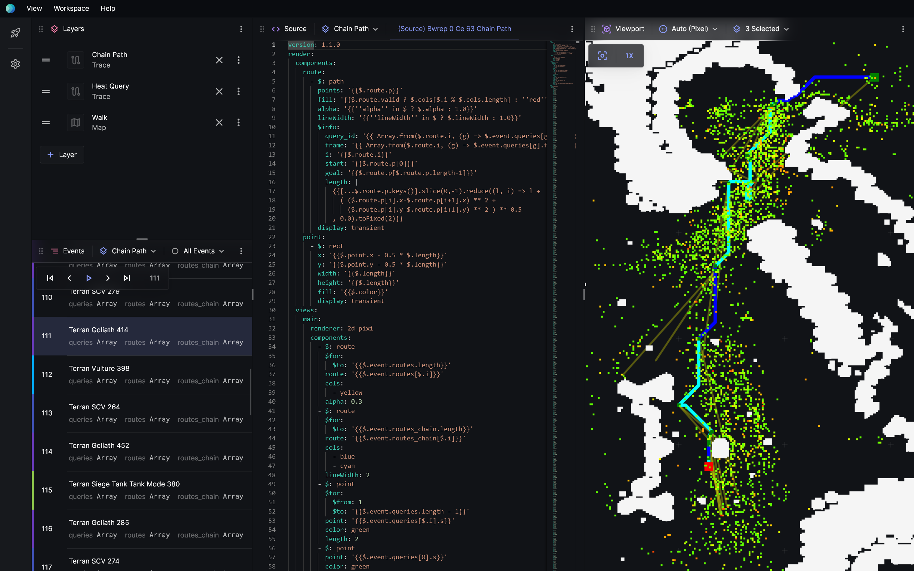

Hey FIT5222 students,

We just released Posthoc integration with Piglet, the pathfinding solver in Python. Leverage the power of visualisation to debug and understand the code you write in Piglet.

## Getting Piglet

Get Piglet with Posthoc visualisation support by cloning or pulling the latest version of Piglet from [this repository](https://bitbucket.org/fit5222/piglet-public/src/single-agent-prac/).

## Introduction to Posthoc

Posthoc is a powerful tool designed for the post-hoc analysis of search algorithms. It allows users to import YAML search trace files and visualise the search process in detail. These search trace files are comprehensive descriptions that include both the process of the search and how to visualise it.



You can learn more about Posthoc on our [official website](https://posthoc.pathfinding.ai).

Posthoc is particularly useful when you want to visualise how your solver operates. For instance, if you are using Piglet as your solver, as long as Piglet can output YAML search traces, Posthoc can visualise it.

To recap, search traces represent your search process. A typical search trace file in YAML format looks like this:

```yaml
version: 1.4.0
views:
  main:
    - $: rect
      alpha: 1
      fill: ${{ theme.foreground }}
      height: 1
      width: 1
      x: ${{ $.x }}
      y: ${{ $.y }}
pivot:
  scale: 1
  x: ${{ $.x + 0.5 }}
  y: ${{ $.y + 0.5 }}
events:
  - {
      depth: 0,
      f: 147.05441,
      g: 0,
      h: 147.05441,
      id: DHQPrdoA,
      pId: null,
      type: source,
      x: 277,
      y: 186,
    }
  - {
      depth: 0,
      f: 0.0,
      g: 0,
      h: 0.0,
      id: DHQPrdsI,
      pId: null,
      type: destination,
      x: 273,
      y: 39,
    }
```

Check out the [search trace documentation](https://posthoc.pathfinding.ai/docs/search-trace) for more information.

### Generating Search Traces in Piglet

_The following are new features in Piglet.
Before proceeding, make sure you clone or pull the latest version of Piglet from
[this repository](https://bitbucket.org/fit5222/piglet-public/src/single-agent-prac/)._

Piglet provides built-in support for outputting search traces, and the process is flexible based on your needs. To generate these traces, you can use the `--log trace` argument in the command line. This argument will print the search trace directly to the console:

```bash
python3 piglet.py -p ./example/arena2.map.scen -f graph -s a-star --log trace -x 30 -n 1
```

<video width="100%" controls>
  <source src="/assets/clips/trace-console.mp4" type="video/mp4" />
</video>

If you'd prefer to output the trace to a file, use the `--log trace-file` argument. By default, this will create a randomly named file in your current directory. To specify a custom filename, add the `-lf [filenamehere]` argument, where `lf` is short for `log-filename`:

```bash
python3 piglet.py -p ./example/arena2.map.scen -f graph -s a-star --log trace-file -lf my-trace.trace.yaml -x 30 -n 1
```

<video width="100%" controls>
  <source src="/assets/clips/trace-file.mp4" type="video/mp4" />
</video>

Since scenario files often contain hundreds of problem instances, it is helpful to use the `--problem-index` (`-x`) and `--problem-number` (`-n`) arguments to specify which specific problem to run and generate a search trace for. For example:

```bash
python3 piglet.py -p ./example/arena2.map.scen -f graph -s a-star --log trace -x 30 -n 1
```

<video width="100%" controls>
  <source src="/assets/clips/simple-trace.mp4" type="video/mp4" />
</video>

This command will run the 30th problem instance in the specified file. Once the process is complete, you should see a file named `a-star-graph-XXXXXX.trace.yaml` in the current directory (or your specified filename if you used `-lf`). You can then drag this file into Posthoc for visualisation.

### How Piglet Generates Search Traces

The `logging/` and `output/` sub-packages in Piglet are responsible for generating the YAML output. In `search/graph_search.py` and other search scripts, you'll notice `log` method calls such as:

```python
self.log("solution", current)
```

These calls take search nodes and eventually use the previously mentioned packages to output them as events in the YAML format.

## Practical Exercises

These exercises will help you understand how to use Posthoc with Piglet in different scenarios.

### Breadth-First Search (BFS) vs. Depth-First Search (DFS)

Generate search traces for breadth-first search and depth-first search using the arena2 map. Use the following commands:

```bash
python3 piglet.py -p ./example/arena2.map.scen -f graph -s breadth --log trace-file -t 0.05 -x 2 -n 1
```

```bash
python3 piglet.py -p ./example/arena2.map.scen -f graph -s depth --log trace-file -t 0.05 -x 2 -n 1
```

To limit the size of the output, a small problem instance is selected using the `-x` and `-n` arguments, and the runtime is limited to 10 milliseconds with the `-t` argument.

After generating the files, drag them into Posthoc.

- Inspect the search in the Viewport.
- Play back the search.
- Use the Graph view to analyse the search.

You should observe distinct differences in the functioning of these two search techniques.

<video width="100%" controls>
  <source src="/assets/clips/dfs-bfs.mp4" type="video/mp4" />
</video>

### A\* Search

Run the following command to generate an A\* search trace and try out different visualisation features:

```bash
python3 piglet.py -p ./example/arena2.map.scen -f graph -s a-star --log trace-file -x 100 -n 1
```

Explore the following:

- Inspect the search in the Viewport.
- Play back the search.

You can also experiment with different visualisations by modifying the search trace preamble. Here’s an example using the A\* algorithm on an 8-tile puzzle:

```bash
python3 piglet.py -p ./example/example_8_puzzle.scen -f tree -s a-star --log trace-file -x 1 -n 1
```

<video width="100%" controls>
  <source src="/assets/clips/nine-tile.mp4" type="video/mp4" />
</video>

### Comparing A\* and Weighted A\* Search

See how A\* search compares with A\* search that uses a weighted heuristic. Run the following command, replacing `WEIGHT` with values such as 0, 0.5, 1.0, and 8.0:

```bash
python3 piglet.py -p ./example/arena2.map.scen -f graph -s a-star --heuristic-weight WEIGHT --log trace-file -x 8 -n 1
```

Experiment with the following:

- Play back the search and observe the differences in behavior.
- Use the graph's property tracking mode to monitor the `h`, `f`, and `g` values.
- Recall that for node `n`, `f(n) = g(n) + h(n)`. Pay attention to how these values change over time and how they influence the search’s behavior.

## Additional Resources

For more examples and insights on visualising search algorithms, visit the [Posthoc website](https://posthoc.pathfinding.ai).
