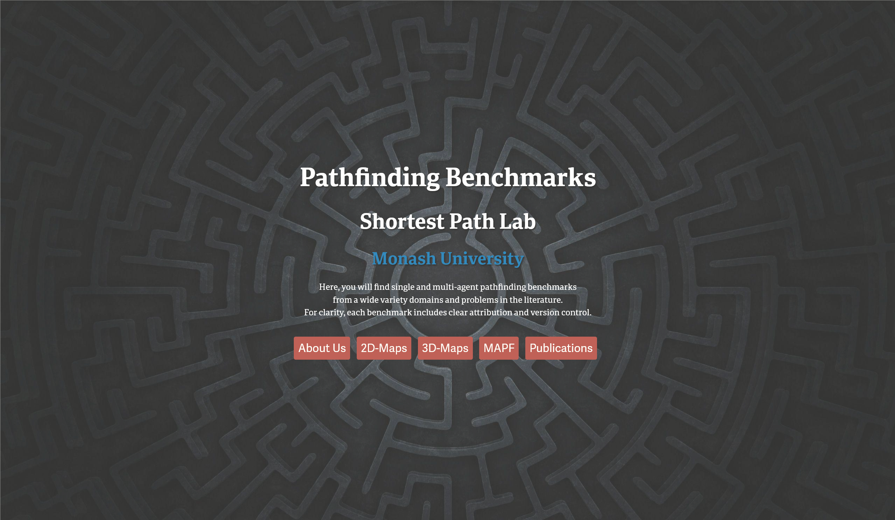

import Member from "@components/Member.astro";
import Grid from "@components/Grid.astro";

This website aims to provide a convenient landing page for a wide-variety of pathfinding benchmarks from various works across the literature. With this, we hope to facilitate efficient and more confident comparisons between works in our community.

Here, you will find mirrors of the many widespread publicly available benchmarks in the literature, and we further host benchmarks developed by our lab. Each data set has clear attribution and follow-through links for those wishing to use these benchmarks in their own work. We provide mirrors of these benchmarks for the purpose of maintaining transparent version control; this helps to avoid misleading conclusions when comparing two works on the same benchmarks at different times—perhaps reporting results on completely different problems!

If we have missed any benchmarks, feel free to [reach out](mailto:shortest-path-lab@monash.edu)!

## Contributors

<Grid class="not-prose my-4 gap-8" width={200}>
  <Member id="current/tnobes" />
  <Member id="current/dharabor" />
</Grid>
