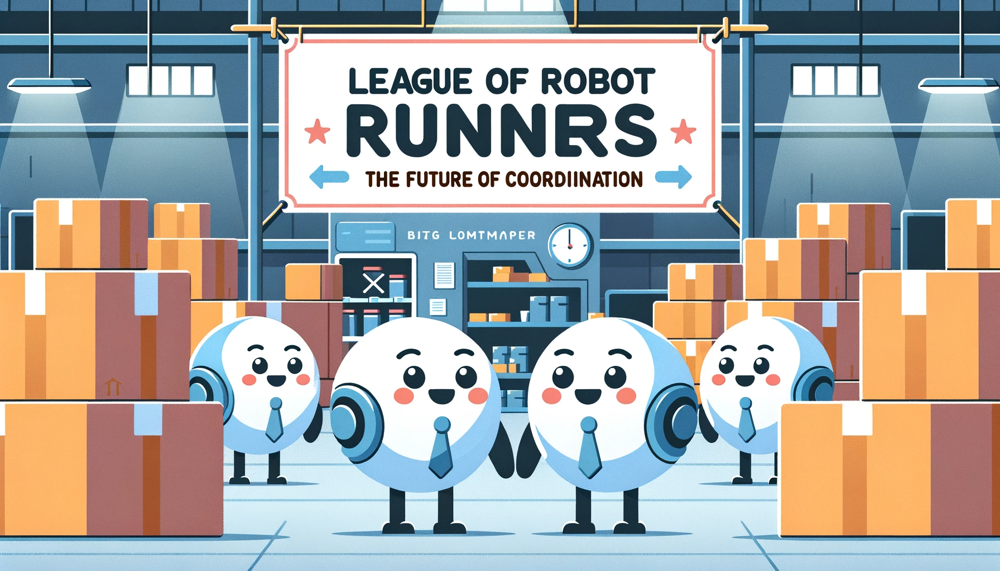

import Member from "@components/Member.astro";
import Grid from "@components/Grid.astro";
import MemberCard from "@components/MemberCard.astro";

## The Competition

The League of Robot Runners is a competition series to foster and advance research areas in the area of Multi-Agent Path Finding.
LoRR aims to:

- identify the core challenges for solving MAPF;
- develop suitable benchmark instances;
- evaluate algorithmic performance in the area and;
- track the state-of-the-art.

The competition provides a standardised system to develop, evaluate, and compare algorithmic techniques.
[Submissions](https://github.com/MAPF-Competition/Code-Archive), [solutions and problem instances](https://github.com/MAPF-Competition/Benchmark-Archive) from the competition are open sourced, to lower barriers, promote dissemination and enable further advancements.

## Competition Series

### 2023 Competition

The first round of the competition was held in 202 and received a total of **825 submissions** from **25 teams worldwide**! The competition identifies two main challenges:

- **Turn actions:**
  In MAPF, robots are often modelled as rotationally invariant agents with unit action costs. This model is disconnected from many applications, where turning
  actions can substantially increase achieved execution costs.
- **Online lifelong problem:**
  In MAPF, the problem is one-shot and
  solved entirely offline.
  Yet real applications are _lifelong_ and _online_: agents receive new tasks upon arrival and they must
  be constantly planned and replanned,
  so as to maximise a throughput objective.

For more details about the setup, results, and resources of the 2023 competition, please visit the [2023 Competition Snapshot Site](https://2023.leagueofrobotrunners.org/).

### 2024 Competition

In 2024, the competition will introduce new tracks with path planning and **task assignments** to reflect the challenges faced by real-world applications.

Fill your email in the [My Submission](https://www.leagueofrobotrunners.org/submission) page to subscribe to our newsletter and receive updates about the upcoming competition!

## Organisers

### Competition Chairs

<Grid class="not-prose my-4 gap-8" width={200}>
  <MemberCard
    member={{
      title: "Daniel Harabor",
      description: "Monash University",
      image:
        "https://github.com/MAPF-Competition/web_resource/blob/develop/external_page_resource/organisers/dharabor_small.png?raw=true",
    }}
  />
  <MemberCard
    member={{
      title: "Sven Koenig",
      description: "University of Southern California",
      image:
        "https://github.com/MAPF-Competition/web_resource/blob/develop/external_page_resource/organisers/sven-old.jpg?raw=true",
    }}
  />
  <MemberCard
    member={{
      title: "Cathy Wu",
      description: "Massachusetts Institute of Technology",
      image:
        "https://github.com/MAPF-Competition/web_resource/blob/develop/external_page_resource/organisers/Cathy_Wu.jpeg?raw=true",
    }}
  />
  <MemberCard
    member={{
      title: "Jingjin Yu",
      description: "Rutgers University",
      image:
        "https://github.com/MAPF-Competition/web_resource/blob/develop/external_page_resource/organisers/JJ-head-500.jpg?raw=true",
    }}
  />
</Grid>

### Organising Committee

<Grid class="not-prose my-4 gap-8" width={200}>
  <MemberCard
    member={{
      title: "Shao-hung Chan",
      description: "University of Southern California",
      image:
        "https://github.com/MAPF-Competition/web_resource/blob/develop/external_page_resource/organisers/shao_hung_head.png?raw=true",
    }}
  />
  <MemberCard
    member={{
      title: "Zhe Chen",
      description: "Monash University",
      image:
        "https://github.com/MAPF-Competition/web_resource/blob/develop/external_page_resource/organisers/zhe_chen.jpg?raw=true",
    }}
  />
  <MemberCard
    member={{
      title: "Teng Guo",
      description: "Rutgers University",
      image:
        "https://github.com/MAPF-Competition/web_resource/blob/develop/external_page_resource/organisers/teng.jpg?raw=true",
    }}
  />
  <MemberCard
    member={{
      title: "Han Zhang",
      description: "University of Southern California",
      image:
        "https://github.com/MAPF-Competition/web_resource/blob/develop/external_page_resource/organisers/han.jpg?raw=true",
    }}
  />
  <MemberCard
    member={{
      title: "Yue Zhang",
      description: "Monash University",
      image:
        "https://github.com/MAPF-Competition/web_resource/blob/develop/external_page_resource/organisers/yue_zhang.png?raw=true",
    }}
  />
</Grid>

### Advisors

<Grid class="not-prose my-4 gap-8" width={200}>
  <MemberCard
    member={{
      title: "Kostas Bekris",
      description: "Rutgers University",
      image:
        "https://github.com/MAPF-Competition/web_resource/blob/develop/external_page_resource/organisers/bekris_2018_01_small.jpg?raw=true",
    }}
  />
  <MemberCard
    member={{
      title: "Federico Pecora",
      description: "Amazon Robotics",
      image:
        "https://github.com/MAPF-Competition/web_resource/blob/develop/external_page_resource/organisers/fede-pic.jpeg?raw=true",
    }}
  />
</Grid>
