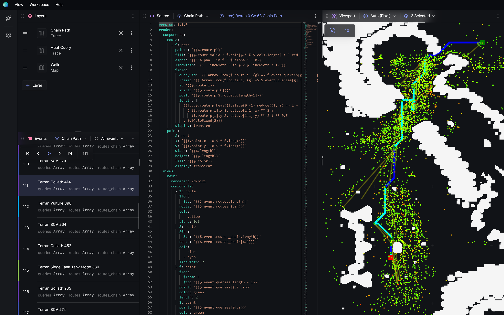

import Member from "@components/Member.astro";
import MemberCard from "@components/MemberCard.astro";
import Grid from "@components/Grid.astro";
import Cite from "@components/Cite.astro";

## Contributors

<Grid class="not-prose my-4 gap-8" width={200}>
  <Member id="current/kzheng" />
  <Member id="current/dharabor" />
  <MemberCard
    member={{
      title: "Michael Wybrow",
      role: "Associate Professor",
      affiliation: "Monash University",
      image:
        "https://research.monash.edu/files-asset/248360374/profile+photo?w=160&f=webp",
    }}
  />
</Grid>

## The framework for understanding search

We present Posthoc, a debugging and visualisation framework
that helps users better understand how search algorithms work. Posthoc
takes as input _search traces_, human-readable output logs produced
by an algorithmic problem solving program. The logs are are used for
subsequent playback, analysis and visualisation.
Our system does not depend on any specific type of
visualisation nor any particular decision-making schema. Being independent,
Posthoc readily complements new and existing solvers: for AI planning,
pathfinding, and heuristic search, and it can be integrated as a complementary
problem-solving tool alongside.

## Screenshots

## Student research projects

### Summer research 2024

We're looking for students to take part in Monash summer vacation research scholarship 2024.
You'll spend twelve weeks working with the team to design and implement features for Posthoc.

- Applications open: Monday 5 August 2024 (12AM AEST)
- Applications close: Friday 23 August 2024 (5PM AEST)
- Notice of outcome: Mid to late October

If you're interested, [apply here](https://www.monash.edu/study/fees-scholarships/scholarships/summer-winter).

## Publications

<Cite source="zheng2024posthoc" variant="block" />
