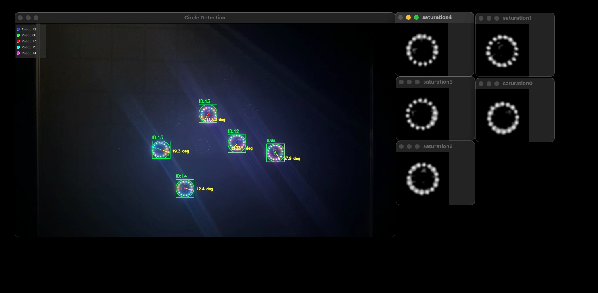

import Grid from "@components/Grid.astro";
import Member from "@components/Member.astro";

## Contributors

<Grid class="not-prose my-4 gap-8" width={200}>
  <Member id="current/ali" />
  <Member id="current/asekercioglu" />
</Grid>

## Overview

This project develops a cost-effective hybrid-reality testbed for evaluating large-scale wheeled robot fleets. The system combines SparkNodes, custom-designed, low-cost wheeled robots, with virtual robots in SparkVerse, allowing external fleet management systems to interact with both through a unified interface without distinguishing between real and simulated agents. Physical SparkNodes execute real movement commands while their positions and orientations are tracked in real time by SparkEyes, an overhead vision-based tracking system.

SparkVerse synchronizes the states of physical and simulated robots to model interactions such as collisions, enabling realistic evaluation of hybrid robot fleets at scales that would be prohibitively expensive using physical robots alone. By bridging the gap between pure simulation and large-scale hardware deployments, the proposed testbed provides a scalable, realistic, and affordable platform for developing and validating multi-robot coordination and fleet management algorithms.
