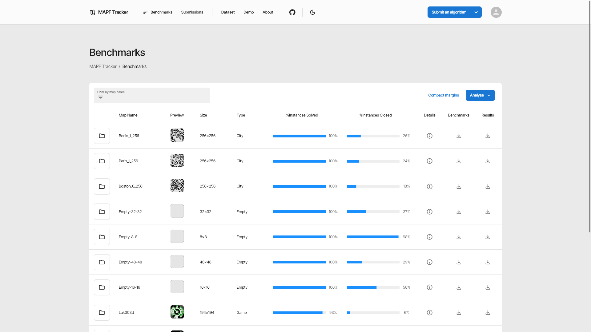

import Member from "@components/Member.astro";
import MemberCard from "@components/MemberCard.astro";
import Grid from "@components/Grid.astro";
import Cite from "@components/Cite.astro";

## Tracking Research Progress

Multi-Agent Path Finding (MAPF) is a combinatorial problem that asks us to compute collision-free paths for teams of cooperative agents. Many works appear on this topic each year, and a large number of substantial advancements and improvements have been reported. Yet measuring overall progress in MAPF is difficult: there are many potential competitors, and the computational burden for comprehensive experimentation is prohibitively large. Moreover, detailed data from past experimentation is usually unavailable.

This online platform introduces a set of methodological and visualisation tools which can help the community establish clear indicators for state-of-the-art MAPF performance and which can facilitate large-scale comparisons between MAPF solvers. Our objectives are to lower the barrier of entry for new researchers and to further promote the study of MAPF.

## Advisors

<Grid class="not-prose my-4 gap-8" width={200}>
  <Member id="current/dharabor" />
  <MemberCard
    member={{
      title: "Peter Stuckey",
      description: "Professor",
      image:
        "https://tracker.pathfinding.ai/static/media/Peter.518af127c75fcb2d5dc4.jpg",
    }}
  />
  <MemberCard
    member={{
      title: "Muhammad Aamir Cheema",
      description: "Associate Professor",
      image:
        "https://tracker.pathfinding.ai/static/media/Aamir.8893714853bcb8b23ba3.jpeg",
    }}
  />
</Grid>

## Team

<Grid class="not-prose my-4 gap-8" width={200}>
  <Member id="alumni/bshen" />
  <Member id="current/zchen" />
  <MemberCard
    member={{
      title: "Will Holdsworth",
      description: "Winter Research 2024",
      image: "/assets/profiles/wholdsworth.jpg",
    }}
  />
  <MemberCard
    member={{
      title: "Ethel Lim",
      description: "Winter Research 2024",
      image: "https://cdn.jsdelivr.net/gh/alohe/avatars/png/notion_8.png",
    }}
  />
  <Member id="current/kzheng" />
</Grid>

## Cite This Project

<Cite source="DBLP:journals/corr/abs-2305-08446" variant="block" />
